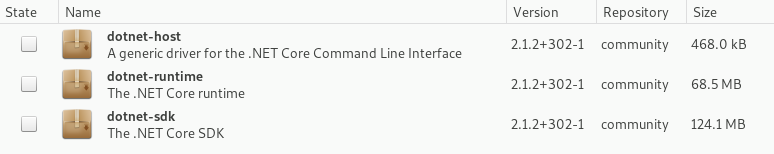
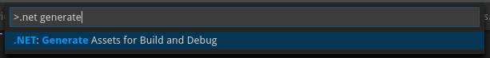

# Capacitación Microservicios: Servicio de catálogo

## Creación del proyecto

Antes de comenzar, recuerde instalar el software descrito en la sección de requisitos.



Abrimos una terminal y creamos una carpeta para la solución.
```bash
mkdir Microservicios
```
Usamos el comando 'dotnet new' para crear la solución que contendrá todos los proyectos de la capacitación, al igual que el proyecto de este módulo.
```bash
cd Microservicios
dotnet new sln --name Microservicios
mkdir src
cd src
mkdir Services
cd Services
mkdir Catalog
cd Catalog
dotnet new webapi --name Catalog --output Catalog
cd ../../..
dotnet sln add src/Services/Catalog/Catalog.csproj
```

Si en VS Code aparece un mensaje con el texto 'Missing assets for build and debug' después de crear el Web API, selecciona la opción Sí.

Si accidentalmente eleigste No, ejecuta el siguiente comando en la paleta de comandos.

```
>.NET: Generate Assets for Build and Debug
```

Esto genera los archivos necesarios para ejecutar el proyecto con VS Code.

