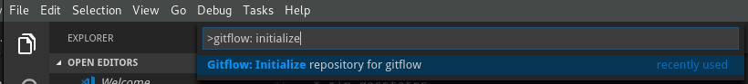
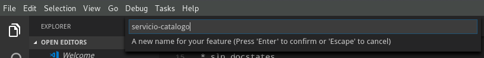
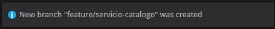

# Capacitación Microservicios: Servicio de catálogo

## Workflow con Git

Usaremos git para el control de versiones del código. Las ramificaciones se harán usando el estilo gitflow. La extensión gitflow nos permite usar la paleta de comandos de VS Code para crear branches de cualquier estilo.

Si no has configurado git, usa los siguientes comandos con tus datos.
```
git config --global user.email "you@example.com"
git config --global user.name "Your Name"
```

El archivo gitignore nos permite definir los archivos que no guardaremos en el repositorio. Crea un archivo con el nombre .gitignore y guardalo en la raíz del proyecto.

#### .gitignore

```
*.swp
*.*~
project.lock.json
.DS_Store
*.pyc
nupkg/

# Visual Studio Code
.vscode

# User-specific files
*.suo
*.user
*.userosscache
*.sln.docstates

# Build results
[Dd]ebug/
[Dd]ebugPublic/
[Rr]elease/
[Rr]eleases/
x64/
x86/
build/
bld/
[Bb]in/
[Oo]bj/
[Oo]ut/
msbuild.log
msbuild.err
msbuild.wrn

# Visual Studio 2015
.vs/
```

Ejecuta este comando en la raíz de la solución para inicializar el repositorio de git.

```bash
git init
```

Una vez inicializado el repositorio, abre la paleta de comandos y ejecuta el siguiente comando para inicializar la estructura GitFlow.

```
>Gitflow: Initialize repository for gitflow
```



Deja los nombres de los branches por defecto. El link en el material extra explica qué significa cada branch.

Vamos a iniciar un branch para empezar a trabajar en el servicio. Para iniciar un feature, ingresa los siguientes comandos en la paleta.

```
>Gitflow: Feature: Start
```


Ingresa el nombre del feature para continuar. El nombre del feature debe describir en pocas palabras la cosa que se va a implementar en el proyecto.





En VS Code, el nombre del branch en el que estamos trabajando aparece en la barra azul abajo de la ventana.


## Ejercicio

Configure git y use VS Code para abrir un feature con el nombre 'catalog'.

## Material extra
 * https://nvie.com/posts/a-successful-git-branching-model/
 * https://github.com/vector-of-bool/vscode-gitflow
 * https://jeffkreeftmeijer.com/git-flow/
 * https://github.com/petervanderdoes/gitflow-avh