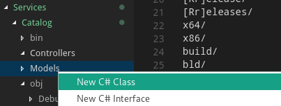
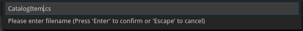
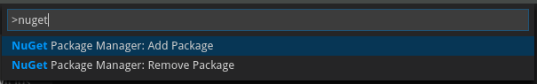
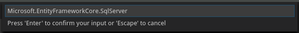
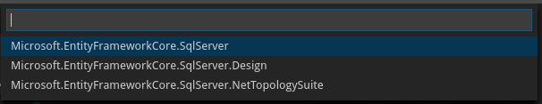
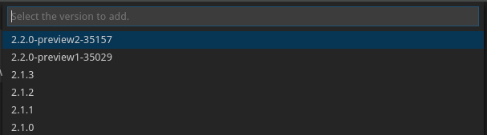
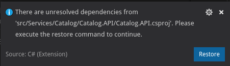

# Capacitación Microservicios: Servicio de catálogo

## Modelo y EF Core
El primer paso es crear las clases que compondrán el modelo de este servicio.

Usaremos el flujo Code-First de Entity Framework Core, donde creamos nuestro modelo mediante clases de C#, y el framework genera tablas con las columnas correspondientes.

Cree una carpeta Model y agregue los siguientes archivos.


Para crear una carpeta, haz clic derecho sobre la carpeta donde se desea crear la nueva carpeta y escoga la opción 'New Folder'.

Para agregar una clase, haga clic derecho sobre la carpeta donde desea crear el archivo y escoga la opción 'New C# Class' (La opción solo se encuentra disponible si se instaló la extensión 'C# Extensions').





#### Model/CatalogBrand.cs
```csharp
namespace Catalog.API.Model
{
    public class CatalogBrand
    {
        public int Id { get; set; }

        public string Brand { get; set; }
    }
}
```

#### Model/CatalogType.cs
```csharp
namespace Catalog.API.Model
{
    public class CatalogType
    {
        public int Id { get; set; }

        public string Type { get; set; }
    }
}
```

#### Model/CatalogItem.cs
```csharp
using System;
using Catalog.API.Infrastucture.Exceptions;

namespace Catalog.API.Model
{
    public class CatalogItem
    {
        public int Id { get; set; }

        public string Name { get; set; }

        public string Description { get; set; }

        public decimal Price { get; set; }

        public string PictureFileName { get; set; }

        public string PictureUri { get; set; }

        public int CatalogTypeId { get; set; }

        public CatalogType CatalogType { get; set; }

        public int CatalogBrandId { get; set; }

        public CatalogBrand CatalogBrand { get; set; }

        // Quantity in stock
        public int AvailableStock { get; set; }

        // Available stock at which we should reorder
        public int RestockThreshold { get; set; }


        // Maximum number of units that can be in-stock at any time (due to physicial/logistical constraints in warehouses)
        public int MaxStockThreshold { get; set; }

        /// <summary>
        /// True if item is on reorder
        /// </summary>
        public bool OnReorder { get; set; }

        public CatalogItem() { }


        /// <summary>
        /// Decrements the quantity of a particular item in inventory and ensures the restockThreshold hasn't
        /// been breached. If so, a RestockRequest is generated in CheckThreshold. 
        /// 
        /// If there is sufficient stock of an item, then the integer returned at the end of this call should be the same as quantityDesired. 
        /// In the event that there is not sufficient stock available, the method will remove whatever stock is available and return that quantity to the client.
        /// In this case, it is the responsibility of the client to determine if the amount that is returned is the same as quantityDesired.
        /// It is invalid to pass in a negative number. 
        /// </summary>
        /// <param name="quantityDesired"></param>
        /// <returns>int: Returns the number actually removed from stock. </returns>
        /// 
        public int RemoveStock(int quantityDesired)
        {
            if (AvailableStock == 0)
            {
                throw new CatalogDomainException($"Empty stock, product item {Name} is sold out");
            }

            if (quantityDesired <= 0)
            {
                throw new CatalogDomainException($"Item units desired should be greater than cero");
            }

            int removed = Math.Min(quantityDesired, this.AvailableStock);

            this.AvailableStock -= removed;

            return removed;
        }

        /// <summary>
        /// Increments the quantity of a particular item in inventory.
        /// <param name="quantity"></param>
        /// <returns>int: Returns the quantity that has been added to stock</returns>
        /// </summary>
        public int AddStock(int quantity)
        {
            int original = this.AvailableStock;

            // The quantity that the client is trying to add to stock is greater than what can be physically accommodated in the Warehouse
            if ((this.AvailableStock + quantity) > this.MaxStockThreshold)
            {
                // For now, this method only adds new units up maximum stock threshold. In an expanded version of this application, we
                //could include tracking for the remaining units and store information about overstock elsewhere. 
                this.AvailableStock += (this.MaxStockThreshold - this.AvailableStock);
            }
            else
            {
                this.AvailableStock += quantity;
            }

            this.OnReorder = false;

            return this.AvailableStock - original;
        }
    }
}
```

La clase CatalogType utiliza una excepción creada por el usuario para notificar cuando ocurre un error relacionado a las reglas de negocio. Lanza la excepción cuando se intenta sacar producto del almacén sin que haya existencias o si se intenta sacar una cantidad menor a una unidad.

Añadimos esta excepción a la carpeta Exceptions.

#### Infrastucture/Exceptions/CatalogDomainException.cs
```csharp
using System;

namespace Catalog.API.Infrastucture.Exceptions
{
    public class CatalogDomainException : Exception
    {
        public CatalogDomainException()
        { }

        public CatalogDomainException(string message)
            : base(message)
        { }

        public CatalogDomainException(string message, Exception innerException)
            : base(message, innerException)
        { }
    }
}
```

Entity Framework Core es un ORM que nos permite mapear las claes creadas en nuestro modelo a tablas de una base de datos relacional. EF Core se instala como un paquete NuGet.

Para instalar un paquete NuGet podemos usar los siguientes comandos dentro de la carpeta del proyecto. 

```
dotnet add package Microsoft.EntityFrameworkCore.SqlServer
dotnet add package Microsoft.EntityFrameworkCore.Tools
dotnet add package Microsoft.EntityFrameworkCore.SqlServer.Design
dotnet add package Microsoft.EntityFrameworkCore.Design
```

O podemos usar la extensión NuGet Package Manager para instalar las dependencias mediante la paleta de comandos.

```
>NuGet Package Manager: Add Package
```



Procedemos a buscar el paquete que deseamos instalar en la ventana que aparece.



Seleccionamos el paquete de la lista de resultados.



Elegimos la versión estable más reciente.



También es necesario agregar unas utilidades de línea de comandos que nos servirán al momento de crear migraciones del modelo de base de datos.

Abra el archivo .csproj y agregue el siguiente ItemGroup
```xml
<ItemGroup>
    <DotNetCliToolReference Include="Microsoft.VisualStudio.Web.CodeGeneration.Tools" Version="2.0.3" />
    <DotNetCliToolReference Include="Microsoft.EntityFrameworkCore.Tools.DotNet" Version="2.0.3" />
</ItemGroup>
```

Nuestro archivo .csproj debe quedar de la siguiente manera.

#### Catalog.csproj
```xml
<Project Sdk="Microsoft.NET.Sdk.Web">

  <PropertyGroup>
    <TargetFramework>netcoreapp2.1</TargetFramework>
  </PropertyGroup>

  <ItemGroup>
    <Folder Include="wwwroot\" />
  </ItemGroup>

  <ItemGroup>
    <PackageReference Include="Microsoft.AspNetCore.App"/>
    <PackageReference Include="Microsoft.EntityFrameworkCore.SqlServer" Version="2.1.3"/>
    <PackageReference Include="Microsoft.EntityFrameworkCore.Tools" Version="2.1.3"/>
    <PackageReference Include="Microsoft.EntityFrameworkCore.SqlServer.Design" Version="1.1.6"/>
    <PackageReference Include="Microsoft.EntityFrameworkCore.Design" Version="2.1.3"/>
  </ItemGroup>

  <ItemGroup>
    <DotNetCliToolReference Include="Microsoft.VisualStudio.Web.CodeGeneration.Tools" Version="2.0.3" />
    <DotNetCliToolReference Include="Microsoft.EntityFrameworkCore.Tools.DotNet" Version="2.0.3" />
  </ItemGroup>

</Project>
```

Después de agregar las librerías, aparecerá el siguiente mensaje en VS Code.



Al presionar Restore, .NET va a descargar las liberías que hemos agregado al proyecto. Este paso es necesario cada vez que agregamos liberías nuevas. Este paso también se realizará automáticamente al momento de compilar, de ser necesario.

Para usar EF Core en nuestro servicio, se necesita crear una clase context. Esta clase representa nuestra conexión con la base de datos. En ella se agregarán los DbSet que representan cada tabla del modelo.

Para configurar la manera en la que se configurarán las tablas de cada entidad, se usan clases Entity Configuration. Cree una carpeta EntityConfigurations en Infrastucture y cree las siguientes clases.

#### Infrastucture/EntityConfigurations/CatalogBrandEntityTypeConfiguration.cs
```csharp
using Microsoft.EntityFrameworkCore;
using Microsoft.EntityFrameworkCore.Metadata.Builders;
using Catalog.API.Model;

namespace Catalog.API.Infrastructure.EntityConfigurations
{
    class CatalogBrandEntityTypeConfiguration
        : IEntityTypeConfiguration<CatalogBrand>
    {
        public void Configure(EntityTypeBuilder<CatalogBrand> builder)
        {
            builder.ToTable("CatalogBrand");

            builder.HasKey(ci => ci.Id);

            builder.Property(ci => ci.Id)
               .ForSqlServerUseSequenceHiLo("catalog_brand_hilo")
               .IsRequired();

            builder.Property(cb => cb.Brand)
                .IsRequired()
                .HasMaxLength(100);
        }
    }
}
```

#### Infrastucture/EntityConfigurations/CatalogItemEntityTypeConfiguration.cs
```csharp
using Microsoft.EntityFrameworkCore;
using Microsoft.EntityFrameworkCore.Metadata.Builders;
using Catalog.API.Model;

namespace Catalog.API.Infrastructure.EntityConfigurations
{
    class CatalogItemEntityTypeConfiguration
        : IEntityTypeConfiguration<CatalogItem>
    {
        public void Configure(EntityTypeBuilder<CatalogItem> builder)
        {
            builder.ToTable("Catalog");

            builder.Property(ci => ci.Id)
                .ForSqlServerUseSequenceHiLo("catalog_hilo")
                .IsRequired();

            builder.Property(ci => ci.Name)
                .IsRequired(true)
                .HasMaxLength(50);

            builder.Property(ci => ci.Price)
                .IsRequired(true);

            builder.Property(ci => ci.PictureFileName)
                .IsRequired(false);

            builder.Ignore(ci => ci.PictureUri);

            builder.HasOne(ci => ci.CatalogBrand)
                .WithMany()
                .HasForeignKey(ci => ci.CatalogBrandId);

            builder.HasOne(ci => ci.CatalogType)
                .WithMany()
                .HasForeignKey(ci => ci.CatalogTypeId);
        }
    }
}
```

#### Infrastucture/EntityConfigurations/CatalogTypeEntityTypeConfiguration.cs
```csharp
using Microsoft.EntityFrameworkCore;
using Microsoft.EntityFrameworkCore.Metadata.Builders;
using Catalog.API.Model;

namespace Catalog.API.Infrastructure.EntityConfigurations
{
    class CatalogTypeEntityTypeConfiguration
        : IEntityTypeConfiguration<CatalogType>
    {
        public void Configure(EntityTypeBuilder<CatalogType> builder)
        {
            builder.ToTable("CatalogType");

            builder.HasKey(ci => ci.Id);

            builder.Property(ci => ci.Id)
               .ForSqlServerUseSequenceHiLo("catalog_type_hilo")
               .IsRequired();

            builder.Property(cb => cb.Type)
                .IsRequired()
                .HasMaxLength(100);
        }
    }
}
```

Cree la clase context dentro de la carpeta Infrastructure.

#### Infrastucture/CatalogContext.cs
```csharp
namespace Catalog.API.Infrastructure
{
    using Microsoft.EntityFrameworkCore;
    using EntityConfigurations;
    using Model;
    using Microsoft.EntityFrameworkCore.Design;

    public class CatalogContext : DbContext
    {
        public CatalogContext(DbContextOptions<CatalogContext> options) : base(options)
        {
        }
        public DbSet<CatalogItem> CatalogItems { get; set; }
        public DbSet<CatalogBrand> CatalogBrands { get; set; }
        public DbSet<CatalogType> CatalogTypes { get; set; }

        protected override void OnModelCreating(ModelBuilder builder)
        {
            builder.ApplyConfiguration(new CatalogBrandEntityTypeConfiguration());
            builder.ApplyConfiguration(new CatalogTypeEntityTypeConfiguration());
            builder.ApplyConfiguration(new CatalogItemEntityTypeConfiguration());
        }     
    }


    public class CatalogContextDesignFactory : IDesignTimeDbContextFactory<CatalogContext>
    {
        public CatalogContext CreateDbContext(string[] args)
        {
            var optionsBuilder =  new DbContextOptionsBuilder<CatalogContext>()
                .UseSqlServer("Server=tcp:127.0.0.1,5433;Initial Catalog=CapacitacionMicroservicios.CatalogDb;User Id=sa;Password=Pass@word");

            return new CatalogContext(optionsBuilder.Options);
        }
    }
}
```

En el archivo appsettings.json se configurará el ConnectionString para la conexión con la base de datos.

#### appsettings.json


```json
{
  "ConnectionString": "Server=tcp:127.0.0.1,5433;Initial Catalog=CapacitacionMicroservicios.CatalogDb;User Id=sa;Password=Pass@word",
  "Logging": {
    "IncludeScopes": false,
    "LogLevel": {
      "Default": "Debug",
      "System": "Information",
      "Microsoft": "Information"
    }
  },
  "AllowedHosts": "*"
}

```

El archivo Startup.cs contiene las conciguraciones de los servicios y librerías que se usan en el proyecto.

#### Startup.cs
```csharp
// ...

// Para EF Core
using Catalog.API.Infrastucture;
using Microsoft.EntityFrameworkCore;
using Microsoft.EntityFrameworkCore.Diagnostics;
using System.Reflection;

namespace Catalog.API
{
    public class Startup
    {
        public void ConfigureServices(IServiceCollection services)
        {
            services.AddMvc().SetCompatibilityVersion(CompatibilityVersion.Version_2_1);

            // Para EF Core
            services.AddDbContext<CatalogContext>(options =>
            {
                options.UseSqlServer(Configuration["ConnectionString"],
                                     sqlServerOptionsAction: sqlOptions =>
                                     {
                                         sqlOptions.MigrationsAssembly(typeof(Startup).GetTypeInfo().Assembly.GetName().Name);
                                         //Configuring Connection Resiliency: https://docs.microsoft.com/en-us/ef/core/miscellaneous/connection-resiliency 
                                         sqlOptions.EnableRetryOnFailure(maxRetryCount: 5, maxRetryDelay: TimeSpan.FromSeconds(30), errorNumbersToAdd: null);
                                     });

                // Changing default behavior when client evaluation occurs to throw. 
                // Default in EF Core would be to log a warning when client evaluation is performed.
                options.ConfigureWarnings(warnings => warnings.Throw(RelationalEventId.QueryClientEvaluationWarning));
                //Check Client vs. Server evaluation: https://docs.microsoft.com/en-us/ef/core/querying/client-eval
            });
        }
    }
}
```

EF Core posee un sistema de migraciones. La utilidad de esto es que podemos llevar un control de los cambios hechos al modelo. También podemos actualizar la base de datos al nuevo modelo o restaurarla a un punto anterior.

Cada que se haga un cambio en la base de datos, se debe ejecutar el siguiente comando dentro de la carpeta del proyecto. Después del 'add' se pone un mensaje corto describiendo el cambio hecho en la base de datos.

```bash
dotnet ef migrations add Initial-Migration --context Catalog.API.Infrastucture.CatalogContext -o Infrastructure/CatalogMigrations
```

Es recomendable que se agreguen cambios pequeños a las migraciones, para evitar migraciones demasiado grandes.

Agregamos un ViewModel para definir la forma en la que se recibirán los registros en la consulta general de productos.

#### ViewModel/PaginatedItemsViewModel.cs
```csharp
namespace Catalog.API.ViewModel
{
    using System.Collections.Generic;


    public class PaginatedItemsViewModel<TEntity> where TEntity : class
    {
        public int PageIndex { get; private set; }

        public int PageSize { get; private set; }

        public long Count { get; private set; }

        public IEnumerable<TEntity> Data { get; private set; }

        public PaginatedItemsViewModel(int pageIndex, int pageSize, long count, IEnumerable<TEntity> data)
        {
            this.PageIndex = pageIndex;
            this.PageSize = pageSize;
            this.Count = count;
            this.Data = data;
        }
    }
}
```

Finalmente, creamos una clase para contener la configuración de algunos datos globales.

#### CatalogSettings.cs
```csharp
namespace Catalog.API
{
    public class CatalogSettings
    {
        public string PicBaseUrl { get;set;}

        public string EventBusConnection { get; set; }
    }
}
```

## Material extra
 * https://ardalis.com/how-to-add-a-nuget-package-using-dotnet-add
 * https://docs.microsoft.com/en-us/ef/core/miscellaneous/cli/dotnet
 * https://github.com/aspnet/EntityFramework.Docs/blob/master/entity-framework/core/miscellaneous/configuring-dbcontext.md
 * http://www.entityframeworktutorial.net/efcore/entity-framework-core.aspx
 * https://docs.microsoft.com/en-us/ef/core/get-started/aspnetcore/new-db