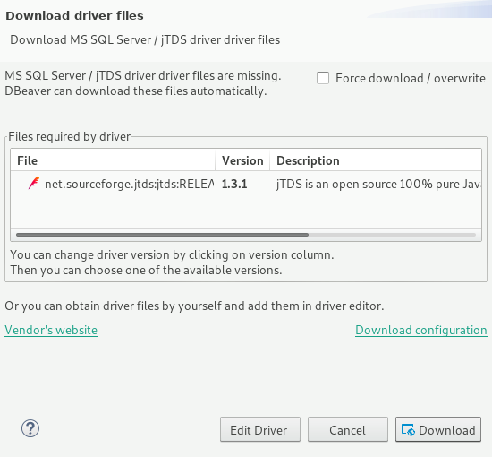
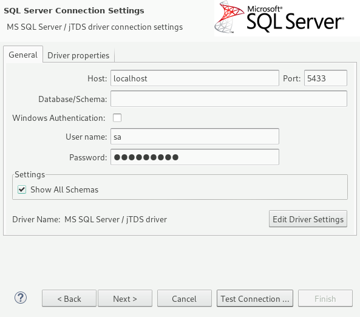
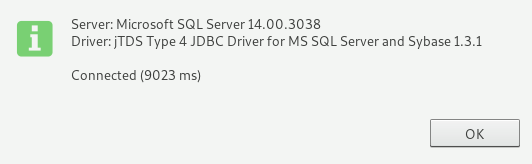
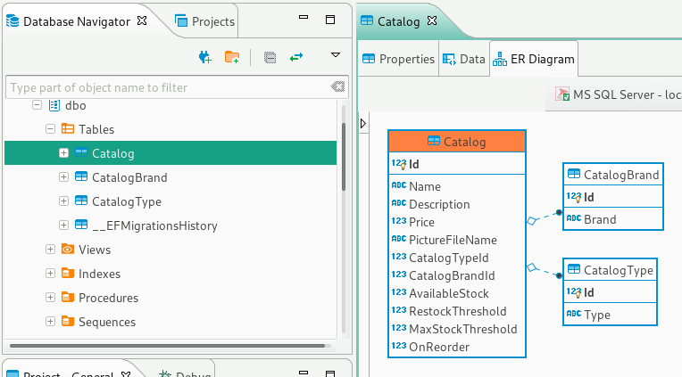
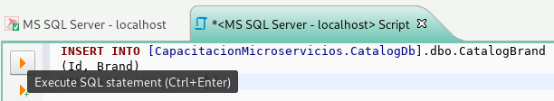
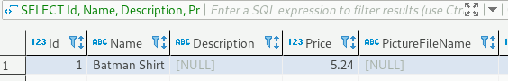
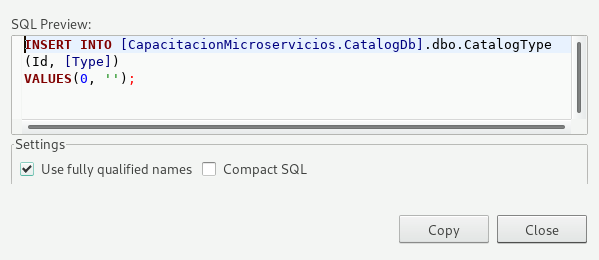
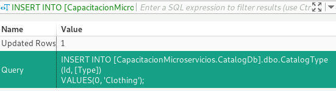

# Capacitación Microservicios: Servicio de catálogo

## Publish con Docker

Los servicios del proyecto se correrán mediante contenedores. Usaremos Docker para crear los contenedores de cada servicio.

El primer paso para generar un contenedor de Docker es definir el Dockerfile del servicio. Este archivo especifica los pasos para generar el contenedor.

Cree el siguiente archivo en la raíz del proyecto.

#### Dockerfile

```dockerfile
FROM microsoft/dotnet:sdk AS build-env
WORKDIR /app

# Copy csproj and restore as distinct layers
COPY *.csproj ./
RUN dotnet restore

# Copy everything else and build
COPY . ./
RUN dotnet publish -c Release -o out

# Build runtime image
FROM microsoft/dotnet:aspnetcore-runtime
WORKDIR /app
COPY --from=build-env /app/out .
ENTRYPOINT ["dotnet", "Catalog.API.dll"]
```

En la terminal, dirígase a la carpeta donde está el Dockerfile y ejecute los siguientes comandos en la terminal

```
sudo usermod -aG docker $USER
sudo systemctl enable docker
docker build -t cdis-capacitacion/catalog.api .
```

El primer comando agrega al usuario al grupo docker, lo que le perimite ejecutar comandos de Docker sin usar sudo.

El segundo comando habilita el servicio de Docker y lo ejecuta cuando se inicie el sistema operativo.

El tercer comando compila la imagen del servicio de catálogo y le pone el nombre de 'cdis-capacitacion/catalog.api'.

La primera vez que se ejecute el comando 'docker-build', Docker buscará las imagenes del runtime y el SDK de .NET Core. Al no encontrarlas, las descargará del Docker Hub, un repositorio de imágenes de Docker. Por esta razón, el proceso de compilación tarda un poco más al principio.

Para reducir el tamaño del contexto de compilación, podemos agregar un archivo .dockerignore en la misma ubicaicón que el Dockerfile.

#### .dockerignore
```
bin\
obj\
```

## Base de datos y servicio de mensajería

El servicio de catalogo depende de dos servicios adicionales:
 * Un servidor de SQL Server
 * Un servidor de RabbitMQ

Podemos acceder a estos servicios creando contenedores a partir de sus imágenes del Docker Hub.

Sus respectivas imágenes en el Docker Hub son:
 * microsoft/mssql-server-linux:2017-latest
 * rabbitmq:3-management

Podemos iniciar esas imágnes manualmente, pero el proceso se puede automatizar usando una herramienta llamada Docker Compose.

Docker Compose nos permite definir la forma en la que se crearán los diferentes contenedores de nuestra aplicación. Es muy útil cuando tenemos servicios que dependen de otros servicios, porque nos permite definir el orden en el que deben levantarse.

Para usar Docker Compose, creamos un archivo docker-compose.yml en la raíz de la solución.

#### docker-compose.yml
```yml
version: '3.7'

services:

  sql.data:
    image: microsoft/mssql-server-linux:2017-latest

  rabbitmq:
    image: rabbitmq:3-management
    ports:
      - "15672:15672"
      - "5672:5672"

  catalog.api:
    image: cdis-capacitacion/catalog.api
    build:
      context: ./src/Services/Catalog/Catalog.API
      dockerfile: Dockerfile 
    restart: on-failure   
    depends_on:
      - sql.data
      - rabbitmq
```

El archivo define los tres servicios que conforman nuestra aplicación. La propiedad image especifica el nombre de la imagen del servicio (Especificamos el nombre de la imagen del servicio de catalogo con el atributo '-t' del comando 'docker build -t cdis-capacitacion/catalog.api .'). 

También se definen los puertos de a los que corresponde cada servicio. El primer número especifica el puerto del host que expondrá el servicio, mientras que el segundo número especifica el puerto definido por el servidor dentro del contenedor. Al hacer una petición al puerto definido por el primer número, Docker redirigirá el mensaje al puerto correspondiente dentro del contenedor. Esto evita el choque de puertos que ocurriría al tener varias instancias de un mismo servidor.

El archivo docker-compose.override.yml define las variables de entorno para cada servicio. También nos permite crear configuraciones para diferentes entornos (podemos, por ejemplo, crear un archivo docker-compose.test.yml y otro docker-compose.prod.yml).

#### docker-compose.override.yml
```yml
version: '3.7'

services:

  sql.data:
    environment:
      - MSSQL_SA_PASSWORD=Pass@word
      - ACCEPT_EULA=Y
      - MSSQL_PID=Developer
    ports:
      - "5433:1433"

  catalog.api:
    environment:
      - ASPNETCORE_ENVIRONMENT=Development
      - ASPNETCORE_URLS=http://0.0.0.0:80
      - ConnectionString=${ESHOP_AZURE_CATALOG_DB:-Server=tcp:sql.data;Initial Catalog=CapacitacionMicroservicios.CatalogDb;User Id=sa;Password=Pass@word}
      - EventBusConnection=${ESHOP_AZURE_SERVICE_BUS:-rabbitmq}
      - EventBusUserName=guest
      - EventBusPassword=guest        
      - UseCustomizationData=True
    ports:
      - "5101:80"
```

Para levantar los servicios, ejecute el siguiente comando en la carpeta donde se ubica el archivo docker-compose.yml

```bash
docker-compose up
```

El comando descargará las imagenes y levantará los servicios con la configuración dada.

Antes de probar la aplicación, es necesario actualizar la base de datos para que corresponda al modelo que definirmos. En una terminal separada, ejecute el siguiente comando en la carpeta donde se ubica el archivo .csproj.

```bash
dotnet ef database update
```

O podemos agregar esta línea de código al método Configure de Startup.cs. Esto hace que la base de datos se actualice cuando inicia la aplicación.

#### Startup.cs
```diff
-   public void Configure(IApplicationBuilder app, IHostingEnvironment env)
+   public void Configure(IApplicationBuilder app, IHostingEnvironment env, CatalogContext db)
        {
            // ...

+           db.Database.Migrate();
        }
```

Si ocurre un error, es posible que haya una discrepancia en los connection strings.

Podemos usar una interfaz gráfica para ver que las tablas se hayan creado correctamente. Una opción es usar DBeaver. Este programa es similar al SQL Server Management Studio o al MySQL Workbench. Nos permite manipular visualmente nuestra base de datos.

Abra DBeaver y agregue una nueva conexión.








Podemos ver que se creó la base de datos CapacitacionMicroservicios.CatalogDb, como lo especificamos en el contexto.



Ejecutamos algunos querys con datos de prueba para las tablas CatalogBrand y CatalogType

```sql
INSERT INTO [CapacitacionMicroservicios.CatalogDb].dbo.CatalogBrand
(Id, Brand)
VALUES(0, 'DC Comics');
```





```sql
INSERT INTO [CapacitacionMicroservicios.CatalogDb].dbo.CatalogType
(Id, [Type])
VALUES(0, 'Clothing');
```





## Material extra
 * [Docker Documentation](https://docs.docker.com/)
 * https://hub.docker.com/r/microsoft/dotnet/
 * https://github.com/dotnet/dotnet-docker/blob/master/samples/aspnetapp/README.md
 * https://github.com/dotnet/dotnet-docker/blob/master/samples/dotnetapp/README.md
 * https://github.com/phusion/baseimage-docker
 * https://hub.docker.com/r/microsoft/mssql-server-linux/
 * https://stackoverflow.com/questions/45712122/connection-string-for-sqlserver-in-docker-container