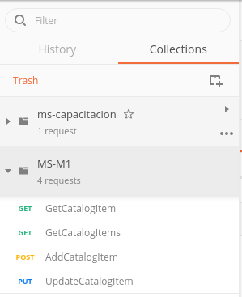

# Capacitación Microservicios: Módulo 2 - Postman

Antes de probar el microservicio, cambie el puerto del servidor en el archivo Properties/launchSettings.json a 5101. La propiedad applicationUrl contiene la ruta que se va a usar para acceder al microservicio.

```json
{
  "$schema": "http://json.schemastore.org/launchsettings.json",
  "iisSettings": {
    "windowsAuthentication": false, 
    "anonymousAuthentication": true, 
    "iisExpress": {
      "applicationUrl": "http://localhost:41227",
      "sslPort": 44373
    }
  },
  "profiles": {
    "IIS Express": {
      "commandName": "IISExpress",
      "launchBrowser": true,
      "launchUrl": "api/values",
      "environmentVariables": {
        "ASPNETCORE_ENVIRONMENT": "Development"
      }
    },
    "Catalog.API": {
      "commandName": "Project",
      "launchBrowser": true,
      "launchUrl": "api/values",
      "applicationUrl": "https://localhost:5101",
      "environmentVariables": {
        "ASPNETCORE_ENVIRONMENT": "Development"
      }
    }
  }
}
```

En la terminal, vaya a la carpeta donde se ubica el archivo csproj y ejecute el siguiente comando.

```bash
dotnet build
```

Este comando compila el proyecto y descarga las dependencias faltantes, de ser necesario.

Para ejecutar el microservicio, use el siguiente comando.

```bash
dotnet run
```

Ejecute el siguente script usando el Query Tool de pgAdmin para agregar registros a la base de datos.

```sql
INSERT INTO "CatalogType" ("Id","Type") VALUES
(1,'Mug')
,(2,'T-Shirt')
,(3,'Sheet')
,(4,'USB Memory Stick')
;

INSERT INTO "CatalogBrand" ("Id","Brand") VALUES
(1,'Azure')
,(2,'.NET')
,(3,'Visual Studio')
,(4,'SQL Server')
,(5,'Other')
;

INSERT INTO "Catalog" ("Id","Name","Description","Price","PictureFileName","CatalogTypeId","CatalogBrandId","AvailableStock","RestockThreshold","MaxStockThreshold","OnReorder") VALUES
(1,'.NET Bot Black Hoodie','.NET Bot Black Hoodie, and more',19.50,'1.png',2,2,100,0,200,False)
,(2,'.NET Black & White Mug','.NET Black & White Mug',8.50,'2.png',1,3,89,0,200,True)
,(3,'Prism White T-Shirt','Prism White T-Shirt',12.00,'3.png',2,5,56,0,200,False)
,(4,'.NET Foundation T-shirt','.NET Foundation T-shirt',12.00,'4.png',2,2,120,0,200,False)
,(5,'Roslyn Red Sheet','Roslyn Red Sheet',8.50,'5.png',3,5,55,0,200,False)
,(6,'.NET Blue Hoodie','.NET Blue Hoodie',12.00,'6.png',2,2,17,0,200,False)
,(7,'Roslyn Red T-Shirt','Roslyn Red T-Shirt',12.00,'7.png',2,5,8,0,200,False)
,(8,'Kudu Purple Hoodie','Kudu Purple Hoodie',8.50,'8.png',2,5,34,0,200,False)
,(9,'Cup<T> White Mug','Cup<T> White Mug',12.00,'9.png',1,5,76,0,200,False)
,(10,'.NET Foundation Sheet','.NET Foundation Sheet',12.00,'10.png',3,2,11,0,200,False)
,(11,'Cup<T> Sheet','Cup<T> Sheet',8.50,'11.png',3,2,3,0,200,False)
,(12,'Prism White TShirt','Prism White TShirt',12.00,'12.png',2,5,0,0,200,False)
;
```

Para probar la API de nuestro servicio, usaremos la aplicación Postman.

Postman nos permite enviar peticiones de HTTP a las rutas expuestas por la API.

Para crear un producto en el catálogo, se envía una petición POST a la ruta /api/v1/catalog/items, definida en CatalogController.cs

```http
POST http://localhost:5101/api/v1/catalog/items
```

El método CreateProduct recibe como parámetro un CatalogItem con el atributo [FromBody]. Esto significa que el cuerpo de la petición debe contener los datos de un CatalogItem en formato JSON.

Use el template AddOrderItem para ejecutar el flujo de agregar un producto.



Recuerde seleccionar el formato 'JSON (application/json)' en el menú a la derecha de la opción 'binary'. No especificar esto puede provocar un error que retorna una respuesta 515.


Al presionar Send, Postman envía la petición y debe retornar una respuesta 201 Created.


Para revisar la consulta desde la API, envíe una petición GET a la siguiente ruta.


Podemos comitear los cambios desde VS Code.

Primero agregamos los archivos que cambiamos. Seleccione la pestaña Git en la barra del lado izquierdo (la que tiene el ícono con nodos). Ahí verá una lista con todos los archivos modificados o no registrados.

Presione el botón con el tooltip 'Stage all changes', o agrege individualmente los archivos modificados.


Usando la paleta de comandos, ejecute el siguiente comando.


Para terminar un feature, usamos el siguiente comando en la paleta de comandos.

```
>gitflow feature finish
```

Esto hará el merge con la rama de develop y cerrará la rama del feature.

## Ejercicio

Pruebe los métodos del capítulo anterior mediante Postman.