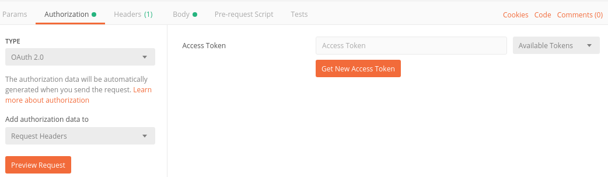
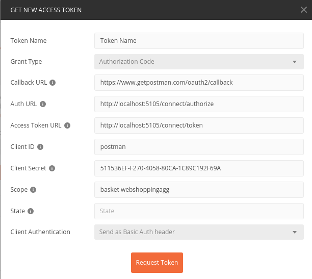

# Capacitación Microservicios: Módulo 2 - Autenticación y autorización

La seguridad de una API se divide en dos partes:

* Autenticación, que es identificar al usuario que intnenta usar el recurso de API
* Autorización, que es determinar si el usuario detectado tiene permiso de acceder al recurso

Para manejar la parte de autenticación, haremos uso del framework [IdentityServer4](http://docs.identityserver.io/en/latest/intro/big_picture.html). El microservicio Identity manejará la lógica de login y autorización.

El proceso de autenticar una petición consiste en los siguientes pasos:

* En el servicio Identity, se definen los recursos (APIs) protegidas y los clientes que pueden acceder (Web MVC, Web SPA, Móvil, Postman)
* El cliente solicita un token al microservicio Identity, que contiene la base de datos de los usuarios.
* El servicio Identity evalúa los datos de la solicitud del token. Si son válidos, abrirá una pantalla de login.
* El usuario hace login mediante la pantalla.
* La pantalla se cierra y se entrega un JWT (JSON Web Token) que contiene la información de la identidad del usuario.
* El cliente hace una consulta a una ruta protegida de la API. La consulta debe contener el token dentro de un header.
* El microservicio que recibe la petición consulta con el microservicio Identity que el token sea valido y el usuario tenga permiso de acceder al recurso. Si está autorizado, el microservicio responde a la petición.

La configuración del servicio Identity se realiza en la clase Config.cs. El método GetApis retorna un arreglo con todas las APIs que requieren autenticación para consumirse.

```csharp
        public static IEnumerable<ApiResource> GetApis()
        {
            return new ApiResource[]
            {
                // orders es el nombre del microservicio que se protegerá
                // Ordering Service es una decripción del servicio
                new ApiResource("orders", "Ordering Service")
            };
        }
```

El método GetClients retorna un arreglo con los clientes que pueden solicitar un token de seguridad. En este caso, se va a registrar Postman como un cliente, de modo que podamos probar las APIs restringidas. El cliente de Postman hace uso del [grant type Code](http://docs.identityserver.io/en/latest/topics/grant_types.html).

Dos propiedades importantes son el ClientSecret (una cadena codificada que usaremos en nuestro cliente para validar que tiene permitido solicitar tokens) y AllowedScopes (donde se registran las APIs a las que este cliente puede solicitar acceso).

```csharp
        public static IEnumerable<Client> GetClients()
        {
            return new[]
            {
                new Client
                {
                    ClientId = "postman",
                    ClientName = "Postman Test Client",
                    ClientSecrets = { new Secret("511536EF-F270-4058-80CA-1C89C192F69A".Sha256()) },
                    AllowedGrantTypes = GrantTypes.Code,
                    AllowAccessTokensViaBrowser = true,
                    RedirectUris =           { $"https://www.getpostman.com/oauth2/callback" },
                    RequireConsent = false,
                    PostLogoutRedirectUris = { $"https://www.getpostman.com" },
                    AllowedCorsOrigins =     { $"https://www.getpostman.com" },
                    AllowedScopes =
                    {
                        IdentityServerConstants.StandardScopes.OpenId,
                        IdentityServerConstants.StandardScopes.Profile,
                        "webshoppingagg"
                    }
                }
            }
        }
```

Cuando un microservicio intente validar un token, consultará el documento discovery del servicio Identity. Este documento contiene información necesaria para la validación del token. Para poder consultarlo, hay que pasar la dirección externa del servicio Identity como variable de entorno en el archivo docker-compose.

En el archivo .env se guarda una variable de entorno que contiene la dirección ip del host donde se ejecuta el sistema (que puede ser la computadora del desarrollador o el servidor).

```env
ESHOP_EXTERNAL_DNS_NAME_OR_IP=192.168.14.119
```

Accedemos a esta variable en el archivo docker-compose.override.yml, de modo que IdentityUrlExternal sea igual a "<http://192.168.14.119:5105">.

```yml
    basket.api:
        environment:
            - IdentityUrlExternal=http://${ESHOP_EXTERNAL_DNS_NAME_OR_IP}:5105
```

Esto es necesario debido a que el contenedor del microservicio tiene una definición de localhost diferente a la del host. Si dentro del microservicio basket se trata de consultar la ruta "http://localhost:5105" (la ruta correspondiente al servicio Identity en el host), no la podrá encontrar.

El servicio Identity usa la librería [ASP.NET Identity](https://docs.microsoft.com/en-us/aspnet/core/security/authentication/identity?view=aspnetcore-2.1&tabs=visual-studio) para el manejo de usuarios.

Para agregar autenticación a un microservicio, se crea un método ConfigureAuth y se ejecuta en Configure de Startup.cs.

```csharp
        protected virtual void ConfigureAuth(IApplicationBuilder app)
        {
            app.UseAuthentication();
        }
```

En el método ConfigureAuthService se pone la configuración de la autenticación del microservicio.

```csharp
        private void ConfigureAuthService(IServiceCollection services)
        {
            // prevent from mapping "sub" claim to nameidentifier.
            JwtSecurityTokenHandler.DefaultInboundClaimTypeMap.Clear();

            var identityUrl = Configuration.GetValue<string>("IdentityUrl");

            services.AddAuthentication(options =>
            {
                options.DefaultAuthenticateScheme = JwtBearerDefaults.AuthenticationScheme;
                options.DefaultChallengeScheme = JwtBearerDefaults.AuthenticationScheme;

            }).AddJwtBearer(options =>
            {
                options.Authority = identityUrl;
                options.MetadataAddress = identityUrl + "/.well-known/openid-configuration";
                options.RequireHttpsMetadata = false;
                options.Audience = "http://identity.api/resources";
                options.TokenValidationParameters = new Microsoft.IdentityModel.Tokens.TokenValidationParameters
                {
                    ValidateIssuer = true,
                    ValidAudiences = new List<string>
                    {
                        "postman",
                    }
                };

            });
        }
```

Por último, se agrega la etiqueta [Authorize] en el controlador que requiera seguridad.

```csharp
    [Route("api/v1/[controller]")]
    [Authorize]
    public class BasketController : Controller
    {
    }
```

Dentro del token podemos guardar claims, que son datos del usuario que inició sesión. Estos datos se guardan en una propiedad llamada "claims". En la clase IdentityService del servicio Basket crearemos un método para obtener el nombre de usuario.

```csharp
    public class IdentityService : IIdentityService
    {
        private IHttpContextAccessor _context;

        public IdentityService(IHttpContextAccessor context)
        {
            _context = context ?? throw new ArgumentNullException(nameof(context));
        }

        public string GetUserIdentity()
        {
            return _context.HttpContext.User.FindFirst("sub").Value;
        }
    }
```

## Ejercicio

Agregue la funcionalidad de autorización en Basket. Para probar que la autorización funciona correctamente, las peticiones mediante Postman debe retornar 401 Unauthorized.

Para obtener un token mediante Postman, se accede a la pensaña Authorization, se selecciona el tipo OAuth 2.0 y se hace clic en GetNewAccessToken. Llene el formulario como en la imagen e inicie sesión para obtener el token. Las peticiones deben retornar sus valores correctos si tiene el token en los headers.



